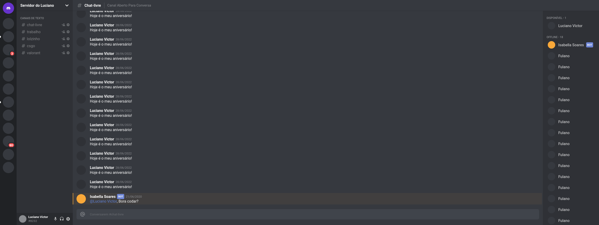

<h1 align="center">Clone Discord</h1>
<p align="center">
  
</p>

<h4 align = "center">
  Cópia da principal interface do aplicativo <a href="https://discord.com/">Discord</a>
</h4>


## 🚀 Dependências usadas no projeto:

-  [React.js](https://pt-br.reactjs.org/)
-  [TypeScript](https://www.typescriptlang.org/)
-  [React-icons](https://react-icons.netlify.com/)
-  [Styled-Components](https://styled-components.com/)


## 💻 Sobre o projeto

Recriar a interface do [Discord](https://discord.com/) como forma de aprendizagem e treinar as skills perante o uso de TypeScript, ReactJS e Flexbox. O desenvolvimento deste projeto só foi capaz graças ao [vídeo](https://www.youtube.com/watch?v=x4FdZd2-_uU) publicado pela Rockeseat.
## 📦 Instalação e execução

```bash
# Clonando o repositório e acessando o diretório
$ git clonehttps://github.com/lucianovictor/discord-clone.git && cd discord-clone

# Instalando as depedências
$ yarn

# Executanto aplicação
$ yarn dev
```
